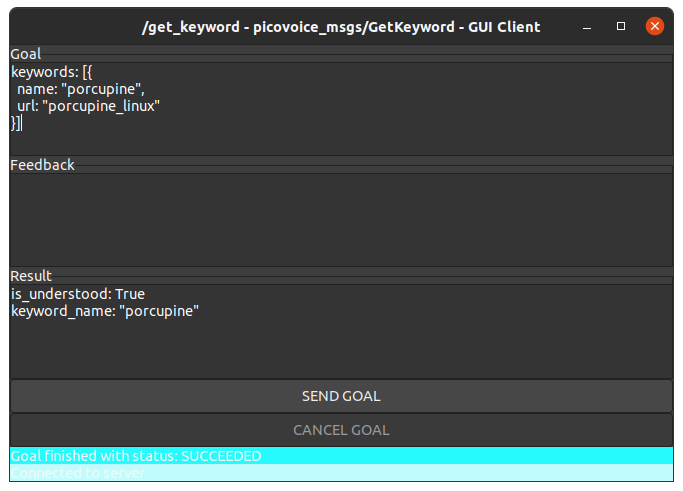
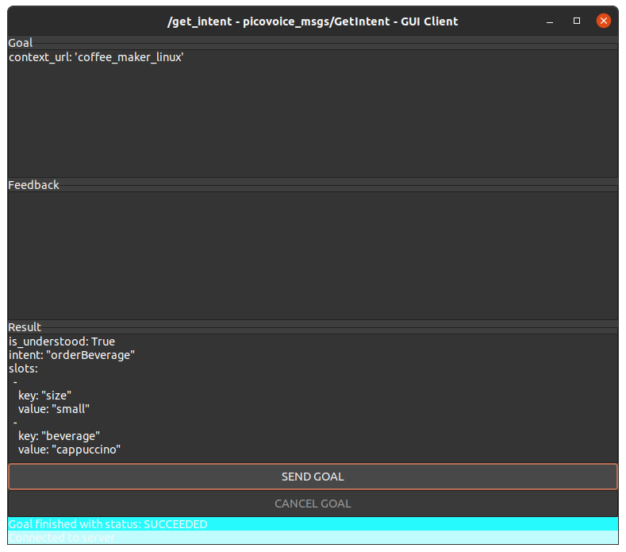

# Picovoice ROS

This repository contains drivers and ROS interfaces for the [Picovoice](https://picovoice.ai/) libraries. Input files can be managed via the [Picovoice console](https://console.picovoice.ai/).

## Installation

```
roscd && cd ../src  # Navigate to the 'src' dir of your catkin workspace 
git clone https://github.com/reinzor/picovoice_ros.git
cd picovoice_ros
rosdep install --from-path -y -i .
catkin_make  # Compile workspace (or catkin build)
```

## Examples

Start a `roscore`:

```
roscore
```

## Keyword recognition (Porcupine)

Start the `porcupine` recognizer from the `picovoice_driver` package

```
rosrun picovoice_driver picovoice_driver_porcupine
```

Start the `axclient` in order to evaluate the action interface of the driver

```
rosrun actionlib_tools axclient.py /get_keyword  # ros-noetic-actionlib-tools (for earlier distro's it should be included in the 'actionlib` package)
```

Set the following as `Goal`

```
keywords: [{
  name: "porcupine",
  url: "porcupine_linux"
}]
```

press `SEND GOAL`, and say "Porcupine"



## Intent recognition (Rhino)

Start the `rhino` recognizer from the `picovoice_driver` package

```
rosrun picovoice_driver picovoice_driver_rhino
```

Start the `axclient` in order to evaluate the action interface of the driver

```
rosrun actionlib_tools axclient.py /get_intent  # ros-noetic-actionlib-tools (for earlier distro's it should be included in the 'actionlib` package)
```

Set the following as `Goal`

```
context_url: 'coffee_maker_linux'
```

and press `SEND GOAL`, and say "Small cappuccino"


